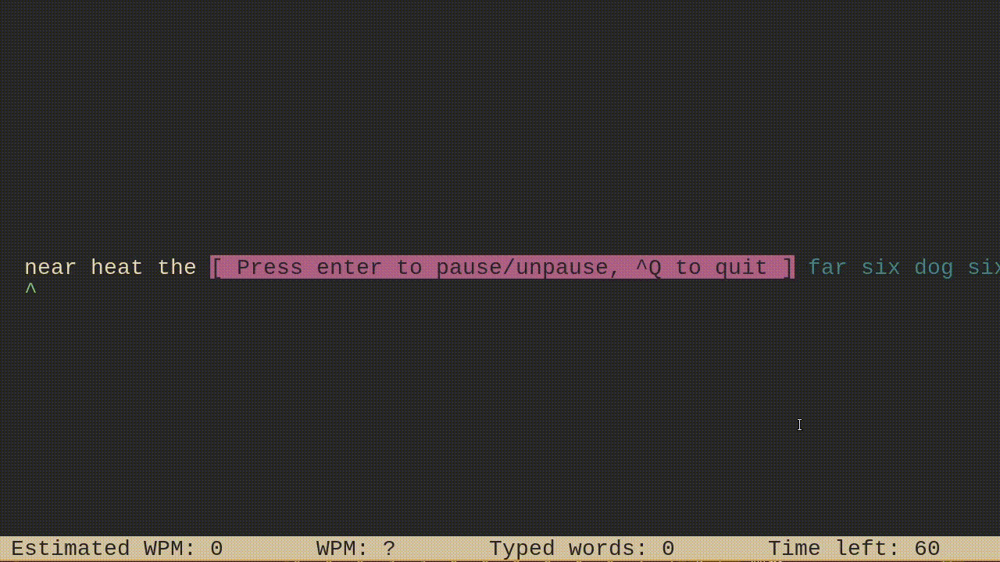

<p align="center">
	<h1 align="center">pas-wpm</h2>
	<p align="center">A simple WPM measurement program</p>
</p>
<p align="center">
	<a href="./LICENSE">
		
	</a>
	<a href="https://github.com/LordOfTrident/pas-wpm/issues">
		
	</a>
	<a href="https://github.com/LordOfTrident/pas-wpm/pulls">
		
	</a>
	<br><br><br>
	
</p>

## Table of contents
* [Introduction](#introduction)
* [Quickstart](#quickstart)
* [Controls](#controls)
* [Bugs](#bugs)
* [Dependencies](#dependencies)
* [Make](#make)

## Introduction
A small and simple WPM measurement program written in Pascal, just for fun.

## Quickstart
```sh
$ make
$ ./bin/app
```

## Controls
| Key        | Action             |
| ---------- | ------------------ |
| ^Q         | Quit               |
| Space      | Finish a word      |
| Enter      | Pause/unpause      |

## Bugs
If you find any bugs, please create an issue and report them.

## Dependencies
- [ncurses](https://en.wikipedia.org/wiki/Ncurses)

## Make
Run `make all` to see all the make rules.
